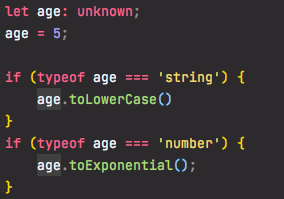

# any ve unknown

### **any**

Değişken tipinin ne olacağını karar veremediğimiz durumlarda **any** ile herhangi bir tip olacağını tanımlayabiliriz. Böylece **TypeScript** tip kontrolü yapmaz. **any** ile tanımlama yaptığımız da **TypeScript** in temel amacı type checking i kullanmadığımızı unutmamalıyız.

```typescript
let age:any;

age = '32';
age = 32;
```

### unknown

Değişken tipinin ne olduğunu bilmediğimiz durumlarda **unknown** tip tanımlamasını kullanabiliriz. Örneğin API dan aldığımız bir değerin tipini bilmediğimiz durumlarda **unknown** tip tanımlamasını kullanabiliriz.

**unknown** tanımlaması yaptığımız bir değişkeni, şart ifadeleri sayesinde istediğimiz duruma göre kullanabiliriz. **any** den ayıran en büyük özelliği, **any** de herhangi bir şart ifadesi olmadan istediğimiz metodu kullanabilmezdi. Bu yüzden **unknown** kullanmak **any** e göre daha güvenlidir.  
  
Örneklerle açıklarsak,


**any** ile değişkenimizi tanımladığımızda, **string** metodu olan **toLowerCase\(\)** i kullandığımızda herhangi bir hata vermiyor.  Ayni ifadeyi **unknown** ile yazdığımız zaman


görüldüğü gibi editörümüz hata veriyor. 



Yukarıda ki gibi şartlı ifadelerle kullandığımız takdirde herhangi bir hata karşımıza çıkmamış olucak. Böylece dinamik bir ifadeyi programımızda kullanırken type checking işlemini sağlamış oluyoruz.

